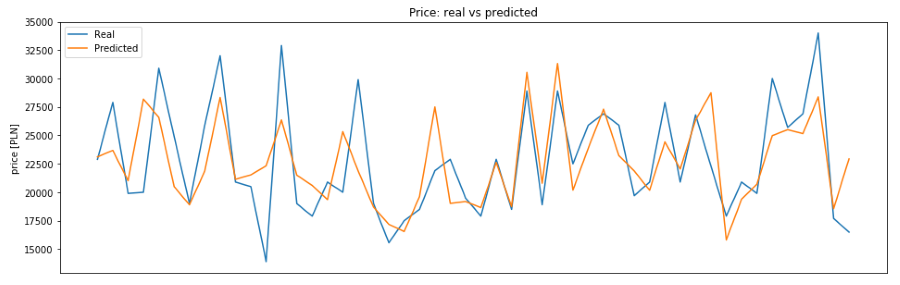
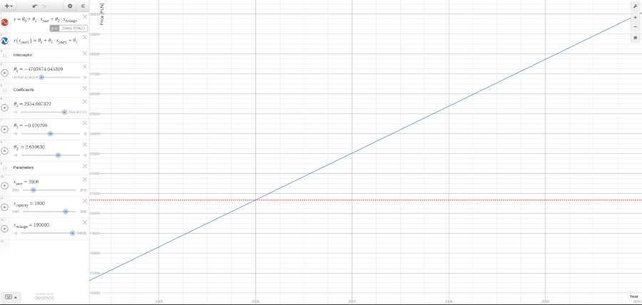

# Car price prediction
 

Want to buy or sell a car? What is adequate price? 

*Machine learning to the rescue!*

This Python's script uses linear regression model (scikit-learn) to predict adequate price for a given car.
As a data source (train&test) it uses real offers from Poland's biggest online vehicle marketplace. 

To predict the best price you will need to specify 3 features:
* year
* mileage [km]
* engine capacity [ccm]  

## Demo
*  [Price prediction of Passat B6 TDI ](passat_b6_tdi_price_prediction.ipynb) - Jupyter notebook

## Run
#### Online
TBD
#### Offline
1. Clone whole repository or download only this [Python script](car_price_prediction.py)
1. Make sure that your environment contains all required libraries (numpy/scipy etc...)
1. Prepare an [URL](https://www.otomoto.pl/osobowe/volkswagen/passat/b6-2005-2010) that points to the offers of wanted vehicle's model ant put it in 'Settings' section
1. Specify also parameters of cars_to_predict_price 
1. Run the script 
1. Have fun!

## Linked resources
- [Desmos calculator](https://www.desmos.com/calculator/vhngcjfwlh)

 
 